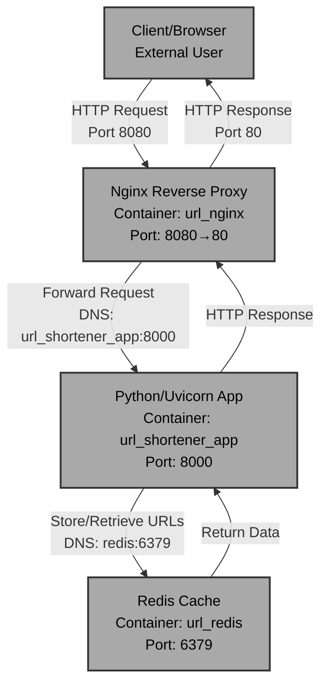

# CloudLab URL Shortener

## Architecture Diagram

## Proposal
CloudLab is a URL shortener service that converts long URLs into short, shareable links and redirects users to the original destination. The project uses Python 3.12-slim for the lightweight application server, Redis for fast caching and storage, and Nginx as a reverse proxy to handle incoming web traffic.

## Build Process

**Line-by-line explanation:**

1. **`FROM python:3.12-slim`** - Uses Python 3.12 slim base image, chosen for its small footprint (~150MB) while maintaining full Python functionality. The slim variant excludes build tools and development files, reducing the final image size and attack surface.

2. **`WORKDIR /app`** - Sets the working directory inside the container, ensuring all subsequent commands execute in this context.

3. **`COPY app/requirements.txt .`** - Copies Python dependencies from the host into the container, placed before the source code to leverage Docker's layer caching (dependencies change less frequently than code).

4. **`RUN pip install --no-cache-dir -r requirements.txt`** - Installs dependencies with `--no-cache-dir` to avoid storing pip's cache in the image, reducing size.

5. **`COPY app /app`** - Copies the entire application source code into the container.

6. **`RUN useradd -m appuser`** - Creates a non-root user for security; running as root is a vulnerability.

7. **`USER appuser`** - Switches to the appuser for all subsequent operations, preventing container escape exploits.

8. **`EXPOSE 8000`** - Documents that the application listens on port 8000 (informational only).

9. **`CMD ["uvicorn", "main:app", "--host", "0.0.0.0", "--port", "8000"]`** - Starts the Uvicorn ASGI server, binding to all network interfaces.

## Networking

**Container Communication:**

The project uses a **Docker Compose bridge network** (default) with three services:

- **App Container** (`url_shortener_app`): Python/Uvicorn service running on port 8000 internally
- **Redis Container** (`url_redis`): Cache/database on port 6379
- **Nginx Container** (`url_nginx`): Reverse proxy exposing port 8080 to the host, forwarding to port 80 internally

**Communication Flow:**

1. **External → Nginx**: Traffic enters via `localhost:8080` (port mapping: `8080:80`)
2. **Nginx → App**: Nginx forwards requests to the app service via **DNS resolution by container name** (`url_shortener_app:8000`)
3. **App → Redis**: The app connects to Redis using the container name (`redis:6379`) as the hostname, resolved by Docker's internal DNS server
4. **Environment Variables**: The app receives `REDIS_HOST=redis` to locate the Redis service

**Key Points:**

- Services communicate by **container name**, not IP addresses (IPs are ephemeral in compose)
- The bridge network provides **automatic DNS resolution** for service discovery
- Docker Compose enforces **startup ordering** via `depends_on` with health checks
- Only Nginx exposes ports to the host; app and Redis are internal-only for security
