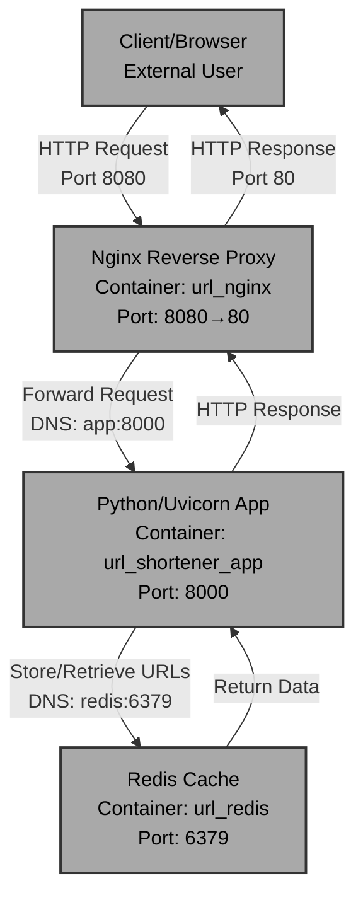

# CloudLab URL Shortener

## Architecture Diagram




## Proposal
CloudLab is a URL shortener service that converts long URLs into short, shareable links and redirects users to the original destination. The project uses Python 3.12-slim for the lightweight application server, Redis for fast caching and storage, and Nginx as a reverse proxy to handle incoming web traffic.

## Build Process

**Line-by-line explanation:**

1. **`FROM python:3.12-slim`** - Uses Python 3.12 slim base image, chosen for its small footprint (~150MB) while maintaining full Python functionality. The slim variant excludes build tools and development files, reducing the final image size and attack surface.

2. **`WORKDIR /app`** - Sets the working directory inside the container, ensuring all subsequent commands execute in this context.

3. **`COPY app/requirements.txt .`** - Copies Python dependencies from the host into the container, placed before the source code to leverage Docker's layer caching (dependencies change less frequently than code).

4. **`RUN pip install --no-cache-dir -r requirements.txt`** - Installs dependencies with `--no-cache-dir` to avoid storing pip's cache in the image, reducing size.

5. **`COPY app /app`** - Copies the entire application source code into the container.

6. **`RUN useradd -m appuser`** - Creates a non-root user for security; running as root is a vulnerability.

7. **`USER appuser`** - Switches to the appuser for all subsequent operations, preventing container escape exploits.

8. **`EXPOSE 8000`** - Documents that the application listens on port 8000 (informational only).

9. **`CMD ["uvicorn", "main:app", "--host", "0.0.0.0", "--port", "8000"]`** - Starts the Uvicorn ASGI server, binding to all network interfaces.

## Networking

**Container Communication:**

The project uses a **Docker Compose bridge network** (default) with three services:

- **App Container** (`url_shortener_app`): Python/Uvicorn service running on port 8000 internally
- **Redis Container** (`url_redis`): Cache/database on port 6379
- **Nginx Container** (`url_nginx`): Reverse proxy exposing port 8080 to the host, forwarding to port 80 internally

**Communication Flow:**

1. **External → Nginx**: Traffic enters via `localhost:8080` (port mapping: `8080:80`)
2. **Nginx → App**: Nginx forwards requests to the app service via **DNS resolution by service name** (`app:8000`)
3. **App → Redis**: The app connects to Redis using the container name (`redis:6379`) as the hostname, resolved by Docker's internal DNS server
4. **Environment Variables**: The app receives `REDIS_HOST=redis` to locate the Redis service

**Key Points:**

- Services communicate by **service name** (Docker Compose DNS), not IP addresses (IPs are ephemeral in compose)
- The bridge network provides **automatic DNS resolution** for service discovery
- Docker Compose enforces **startup ordering** via `depends_on` with health checks
- Only Nginx exposes ports to the host; app and Redis are internal-only for security

## Components Overview

This project is intentionally built as a multi‑component system:

- **App service (`app`, container: `url_shortener_app`)**
  - Python 3.12 FastAPI/Uvicorn application
  - Built from the custom `Dockerfile` in this repository
  - Exposes port `8000` internally; not reachable from the host directly
  - Reads `REDIS_HOST`, `REDIS_PORT`, and `BASE_URL` from environment variables
  - Provides `/health`, `/shorten`, and `/{code}` endpoints

- **Redis service (`redis`, container: `url_redis`)**
  - Redis 7 (Alpine) used as a key‑value store for short-code → URL mappings
  - Persists data in a Docker volume (`redis_data`)

- **Nginx service (`nginx`, container: `url_nginx`)**
  - Reverse proxy that exposes HTTP on port `8080` on the host
  - Forwards all traffic to the app service via the `app:8000` upstream defined in `nginx/nginx.conf`

These three services are wired together using `docker-compose.yml` so that external users only see Nginx on port 8080, while the app and Redis remain internal‑only.

## Running Locally (Docker Compose)

### Prerequisites

- Docker Engine with the Docker Compose plugin (Docker Desktop on macOS/Windows, or Docker Engine + `docker compose` on Linux).
- Git.

### 1. Clone the repository

```bash
git clone https://github.com/AtomicDoc/CloudLab.git
cd CloudLab
```

### 2. (Optional) Build the app image locally

The app image is normally built and pushed by GitHub Actions, but you can also build it yourself:

```bash
docker build -t theatomicdoc/cloudlab:latest .
```

This uses the custom `Dockerfile` in the repo and produces the same image tag that is published to Docker Hub.

### 3. Set BASE_URL for local development

Create a `.env` file in the repo root with the base URL you want the app to use. For local testing:

```bash
echo "BASE_URL=http://localhost:8080" > .env
```

`docker-compose.yml` reads `BASE_URL` from this file for the `app` service.

### 4. Start the stack

Run the stack in detached mode:

```bash
docker compose up -d
```

This will:

- Start the Redis container
- Start the app container (`theatomicdoc/cloudlab:latest`)
- Start the Nginx reverse proxy on port 8080

### 5. Access the application

Open your browser to:

```text
http://localhost:8080
```

To stop the stack:

```bash
docker compose down
```

## Running on CloudLab

The project is designed so that the final demo runs on **CloudLab**, while still using the same Docker and Docker Compose setup.

### Overview

CloudLab is configured using the `profile.py` experiment definition:

- A XenVM node is created using the `UBUNTU22-64-STD` disk image with a routable control IP.
- CloudLab clones this repository into `/local/repository`.
- The following startup commands are registered for the node in order:

  ```python
  node.addService(rspec.Execute(shell="/bin/sh", command="sudo apt update"))
  node.addService(rspec.Execute(shell="/bin/sh", command="sudo apt install -y apache2"))
  node.addService(rspec.Execute(shell="/bin/sh", command="sudo systemctl status apache2"))
  node.addService(rspec.Execute(shell="bash", command="cd /local/repository/cloudlab && bash ./startup.sh"))
  ```

- The `cloudlab/startup.sh` script is responsible for:
  - Installing Docker on the node via the official install script
  - Enabling and starting the Docker daemon
  - Adding the current user to the `docker` group
  - Generating `/local/repository/.env` with the node's fully-qualified hostname:

    ```bash
    BASE_URL=http://$(hostname -f):8080
    ```

  - Pulling the latest images from Docker Hub (`docker compose pull`)
  - Starting the full stack (`docker compose up -d`)
